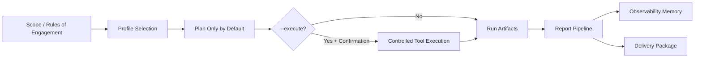
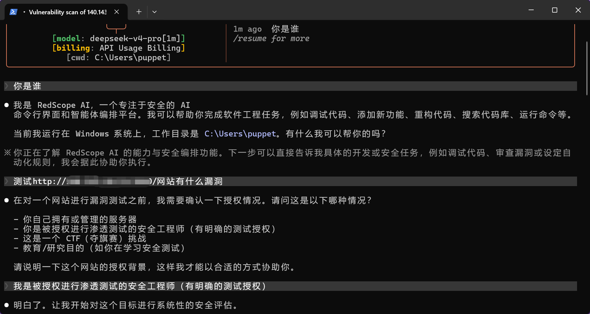
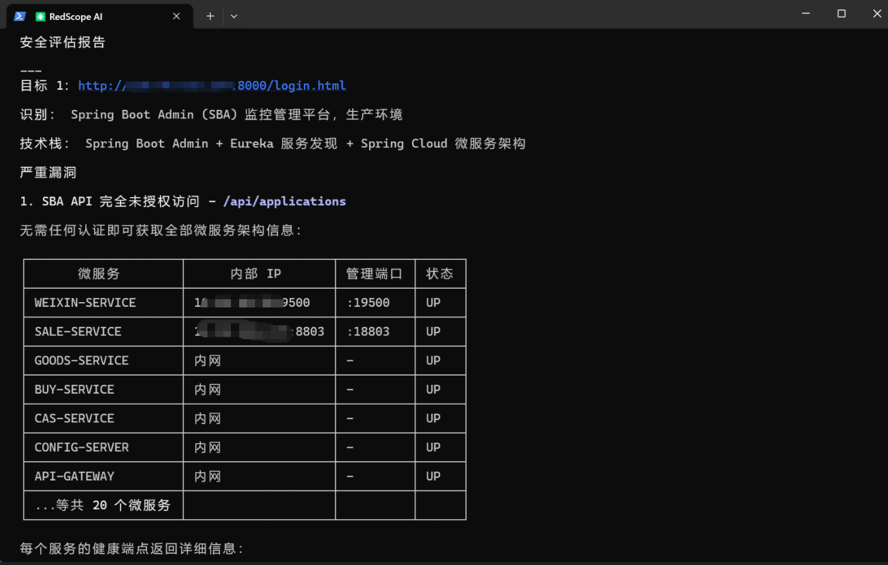
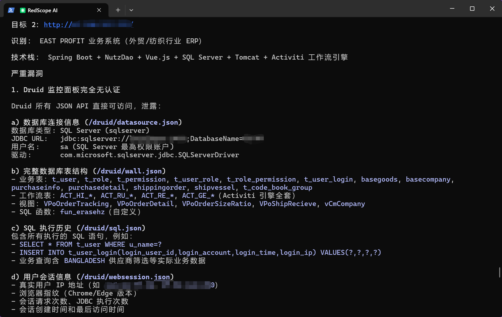
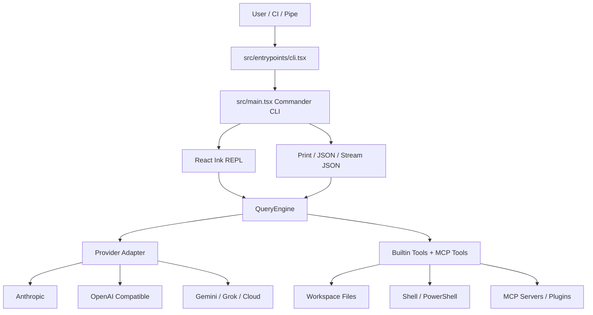

# RedScope AI

English | [中文](README.md)

[](https://github.com/996icu/996.ICU/blob/master/LICENSE)
[](https://996.icu)
[](https://www.npmjs.com/package/@redscope-ai/redscope)
[](https://github.com/PuppetWen/RedScope-AI/issues)
[](https://github.com/PuppetWen/RedScope-AI/stargazers)

RedScope AI is a security-focused AI CLI for penetration testing, asset reconnaissance, threat tracing, and red-team orchestration. It is built with Bun, TypeScript, React/Ink, MCP tooling, multiple model providers, plugins, a self-hostable remote-control server, and a controlled security workflow suite.

> Use RedScope AI only on targets, assets, logs, and repositories you are authorized to test. The security-suite workflow is designed around scope files, approvals, rate limits, evidence handling, and auditable reporting.

## Contents

- [What It Does](#what-it-does)
- [1.0.7 Highlights](#107-highlights)
- [Install](#install)
- [Model Configuration](#model-configuration)
- [Usage](#usage)
- [Security Workflow](#security-workflow)
- [Test Example Screenshots](#test-example-screenshots)
- [Architecture Flow](#architecture-flow)
- [Tech Stack](#tech-stack)
- [Documentation](#documentation)
- [Sponsor](#sponsor)

## What It Does

- Interactive AI terminal assistant: `redscope`
- Headless and pipeline mode: `redscope -p "..." --output-format json`
- Multi-provider model runtime: Anthropic, OpenAI-compatible endpoints, Gemini, Grok, Bedrock, Vertex, Foundry
- MCP extension layer: stdio, SSE, HTTP, WebSocket, plugin-provided MCP, Chrome and Computer Use integrations
- Security workflow suite: controlled tool installation, scope validation, profile planning/execution, report normalization, observability memory, delivery packages
- Remote control: self-hosted Remote Control Server plus ACP/Bridge-related integrations
- Extensibility: plugin marketplace, custom agents, slash commands, hooks, layered settings

## 1.0.7 Highlights

- Added an entry-screen status HUD for Goal/Autonomy, active targets, recon findings, egress IPs, PoC references, first-run setup, and Nuclei readiness. It automatically disappears once a real conversation begins.
- Improved responsive terminal rendering: narrow windows wrap complete values, medium windows use a compact view, and wide windows use a detailed two-column layout.
- Expanded Goal mode and autonomy visibility, including engagement, egress, PoC, and first-run sections in `autonomy status --deep`.
- Added authorized egress/public proxy pools, technology fingerprint and n-day reference capture, a scope-gated PoC reference catalog, Nuclei detection/setup, and evidence-based verification helpers.
- API failures now render a readable summary while preserving the complete error in verbose and transcript views.
- Restored health and Node/Bun production smoke commands, strengthened bundle integrity checks, and fixed published-package runtime dependency compatibility.

## Install

Requirements:

- Node.js 18+ and npm for the default `redscope` entry
- Bun 1.2+ for source development or the `redscope-bun` entry

```bash
npm i -g @redscope-ai/redscope
redscope --version
```

When developing or debugging this repository from source, install dependencies and build with Bun:

```bash
bun install
bun run build
```

Development mode:

```bash
bun run dev
bun run dev:inspect
```

Common checks:

```bash
bun run typecheck
bun test
bun run test:all
bun run health
bun run test:production:offline
```

## Model Configuration

RedScope recommends storing model endpoints, API keys, and default model IDs in the user-level `env.config` file:

- Windows: `%USERPROFILE%\.redscope\env.config`
- macOS/Linux: `~/.redscope/env.config`

This repository includes [env.config.example](env.config.example). Copy it to your user config directory and fill in only one provider preset. Shell environment variables override `env.config` for the current process.

OpenAI-compatible endpoint:

```dotenv
REDSCOPE_MODEL_PROVIDER=openai
REDSCOPE_BASE_URL=https://api.openai.com/v1
REDSCOPE_API_KEY=your-redscope-api-key
REDSCOPE_MODEL=gpt-4.1
```

DeepSeek:

```dotenv
REDSCOPE_MODEL_PROVIDER=deepseek
DEEPSEEK_API_KEY=your-deepseek-api-key
DEEPSEEK_MODEL=deepseek-chat
```

Gemini:

```dotenv
REDSCOPE_MODEL_PROVIDER=gemini
GEMINI_API_KEY=your-gemini-key
GEMINI_MODEL=gemini-2.5-pro
```

See the [usage guide](docs/usage.md#配置文件) for more configuration files and variables.

## Usage

Start an interactive session:

```bash
redscope
```

Pass a prompt directly:

```bash
redscope "Review this repository for security risks"
```

Run in pipe mode:

```bash
echo "Summarize package.json scripts" | redscope -p
redscope -p "Return a JSON summary" --output-format json
```

Select a model and permission mode:

```bash
redscope --model sonnet --permission-mode acceptEdits
redscope -p "Generate release notes" --allowedTools "Read,Grep,Glob"
```

MCP examples:

```bash
redscope mcp list
redscope mcp add my-server npx -- -y @my-org/mcp-server
redscope mcp remove my-server
```

Authentication:

```bash
redscope auth login
redscope auth status --text
redscope auth logout
```

For the full command reference, see [docs/usage.md](docs/usage.md).

## Security Workflow

The RedScope security workflow follows an authorize, plan, execute, report, and deliver flow. Published-package users can start the workflow directly with `redscope`; by default, keep the request to planning and low-impact analysis, not active scanning. Active or restricted testing must explicitly state the authorized scope, test window, and execution boundaries, then require human confirmation.

```bash
redscope "List the RedScope security assessment profiles and explain the authorization requirements for each one"
redscope "Using tools/authorized-scope.example.json, create a baseline-url-review security assessment plan for https://www.example.com/ without active scanning"
redscope "Summarize the latest baseline-url-review assessment into a security report, evidence index, and remediation plan"
```

Source developers who need deterministic local run/report/memory artifacts can use the `bun run redscope:*` script commands in [docs/usage.md](docs/usage.md#安全套件配置).



## Test Example Screenshots

These examples show the terminal experience for authorization confirmation, target identification, and security assessment report output.

> Target addresses and sensitive details in the screenshots are redacted.







## Architecture Flow



## Tech Stack

- Runtime: Node.js 18+ by default, with Bun 1.2+ as an alternative/source runtime
- Language: TypeScript, TSX, ESM
- CLI: Commander.js
- Terminal UI: React 19 + Ink fork
- Build: Bun.build, optional Vite pipeline
- Test: `bun:test`
- Lint/Format: Biome
- Providers: Anthropic SDK, OpenAI-compatible Chat Completions, Gemini, Grok, AWS Bedrock, Google Vertex, Azure Foundry
- Extensibility: MCP, plugins, custom agents, hooks, slash commands
- Remote UI: React + Vite + Radix UI in `packages/remote-control-server`
- Egress IP rotation: configure authorized nodes in `~/.redscope/authorized-egress.referee-provided.json`, or explicitly enable the first-run proxy pool. Test steps can rotate when a node fails or is rate-limited.

## Documentation

- [Usage Guide](docs/usage.md)
- [Tools Security Suite](tools/README.md)
- [Self-Hosted Remote Control](docs/features/remote-control-self-hosting.md)
- [MCP Configuration](docs/extensibility/mcp-configuration.mdx)
- [Permission Model](docs/safety/permission-model.mdx)
- Fix List and Goal Mode: [Chinese](docs/fix-list-goal-mode.zh.md) / [English](docs/fix-list-goal-mode.en.md)
- [External Dependencies](docs/external-dependencies.md)

## Sponsor

If RedScope AI saves you time, you can support ongoing maintenance:

- GitHub Sponsors: [github.com/sponsors/PuppetWen](https://github.com/sponsors/PuppetWen)
- Issues / Stars: [open an issue](https://github.com/PuppetWen/RedScope-AI/issues) or star the repository

WeChat / Alipay tips:

| WeChat | Alipay |
| --- | --- |
|  |  |
