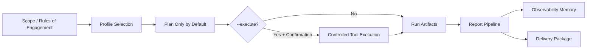
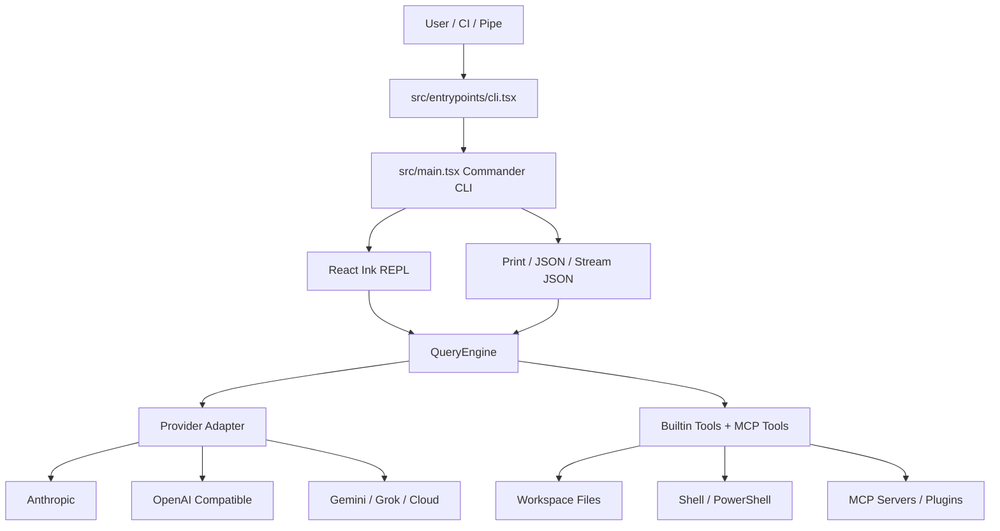

# RedScope AI

[English](README.en.md) | 中文

[](https://github.com/996icu/996.ICU/blob/master/LICENSE)
[](https://996.icu)
[](https://www.npmjs.com/package/@redscope-ai/redscope)
[](https://github.com/PuppetWen/RedScope-AI/issues)
[](https://github.com/PuppetWen/RedScope-AI/stargazers)

RedScope AI 是一个面向安全团队、渗透测试、资产侦察、威胁追踪和红队编排的 AI CLI。它基于 Bun、TypeScript、React/Ink 和 MCP 工具生态构建，提供交互式终端助手、非交互式管道模式、多模型 Provider、插件系统、远程控制服务和一套受控的安全工作流脚本。

> 仅在你拥有授权的目标、资产、日志或代码仓库上使用 RedScope AI。项目内置的安全套件强调 scope、审批、速率限制、证据留存和可审计流程，不鼓励也不支持未授权扫描。

## 目录

- [项目能力](#项目能力)
- [1.0.7 更新重点](#107-更新重点)
- [快速安装](#快速安装)
- [配置模型](#配置模型)
- [基本使用](#基本使用)
- [安全工作流](#安全工作流)
- [测试示例截图](#测试示例截图)
- [项目流程](#项目流程)
- [技术栈](#技术栈)
- [文档](#文档)
- [赞助打赏](#赞助打赏)

## 项目能力

- 交互式 AI 编程与安全分析终端：`redscope`
- 管道/自动化输出：`redscope -p "..." --output-format json`
- 多 Provider：Anthropic、OpenAI 兼容端点、Gemini、Grok、Bedrock、Vertex、Foundry
- MCP 扩展：stdio、SSE、HTTP、WebSocket、插件内置 MCP、Chrome/Computer Use 集成
- 安全工作流：工具安装、scope 校验、profile 计划/执行、报告归一化、观测记忆、交付包
- 远程控制：自托管 Remote Control Server 和 ACP/Bridge 相关能力
- 插件与 Agent：插件 marketplace、自定义 agent、slash command、hooks、settings 分层配置

## 1.0.7 更新重点

- 新增入口状态 HUD：集中展示 Goal/Autonomy、活动目标、侦察发现、出口 IP、PoC 引用、首次设置和 Nuclei 状态；进入界面时显示，正式对话开始后自动隐藏。
- 改进小窗口布局：窄终端改为完整换行展示，中等宽度使用紧凑视图，宽终端使用双栏详细视图。
- 完善 Goal 模式与自动化状态：`/goal` 任务、持续运行状态以及 `autonomy status --deep` 中的 engagement、egress、PoC 和 first-run 信息更清晰。
- 增加授权出口 IP 池、公共代理池、技术指纹与 n-day 引用捕获、PoC 引用目录、Nuclei 安装检测及证据化验证辅助能力。
- API 失败现在显示可读摘要；原始错误仍可在详细模式和 transcript 中查看。
- 补齐 `health`、Node/Bun 生产冒烟测试与 bundle 完整性检查，并修复发布包的运行时依赖兼容问题。

## 快速安装

要求：

- Node.js 18+ 和 npm（默认 `redscope` 入口）
- Bun 1.2+（源码开发或 `redscope-bun` 入口）

```bash
npm i -g @redscope-ai/redscope
redscope --version
```

从源码开发或调试本仓库时，再使用 Bun 安装依赖和构建：

```bash
bun install
bun run build
```

开发模式：

```bash
bun run dev
bun run dev:inspect
```

常用检查：

```bash
bun run typecheck
bun test
bun run test:all
bun run health
bun run test:production:offline
```

## 配置模型

RedScope 推荐把模型端点、API Key 和默认模型写入用户配置目录的 `env.config`，默认路径是：

- Windows: `%USERPROFILE%\.redscope\env.config`
- macOS/Linux: `~/.redscope/env.config`

仓库提供了 [env.config.example](env.config.example)，可复制后按需填写。`env.config` 会在启动时加载，shell 中临时设置的环境变量优先级更高。

OpenAI 兼容端点示例：

```dotenv
REDSCOPE_MODEL_PROVIDER=openai
REDSCOPE_BASE_URL=https://api.openai.com/v1
REDSCOPE_API_KEY=your-redscope-api-key
REDSCOPE_MODEL=gpt-4.1
```

DeepSeek 示例：

```dotenv
REDSCOPE_MODEL_PROVIDER=deepseek
DEEPSEEK_API_KEY=your-deepseek-api-key
DEEPSEEK_MODEL=deepseek-chat
```

Gemini 示例：

```dotenv
REDSCOPE_MODEL_PROVIDER=gemini
GEMINI_API_KEY=your-gemini-key
GEMINI_MODEL=gemini-2.5-pro
```

更多配置项见 [项目使用文档](docs/usage.md#配置文件)。

## 基本使用

启动交互式会话：

```bash
redscope
```

直接传入提示词：

```bash
redscope "帮我审查这个仓库的安全风险"
```

管道模式：

```bash
echo "总结 package.json 的脚本" | redscope -p
redscope -p "输出 JSON 摘要" --output-format json
```

指定模型和权限模式：

```bash
redscope --model sonnet --permission-mode acceptEdits
redscope -p "生成一份发布说明" --allowedTools "Read,Grep,Glob"
```

MCP 示例：

```bash
redscope mcp list
redscope mcp add my-server npx -- -y @my-org/mcp-server
redscope mcp remove my-server
```

认证与状态：

```bash
redscope auth login
redscope auth status --text
redscope auth logout
```

完整命令参考见 [docs/usage.md](docs/usage.md)。

## 安全工作流

RedScope 的安全工作流采用先授权、再计划、再执行、最后归档的流程。发布版用户可以直接用 `redscope` 发起评估；默认只做计划和低影响分析，不会运行主动扫描。主动或受限测试必须在提示词中明确说明已授权范围、测试窗口和执行边界，并由人工确认。

```bash
redscope "列出 RedScope 支持的安全评估 profile，并说明每种 profile 需要的授权条件"
redscope "基于 tools/authorized-scope.example.json，对 https://www.example.com/ 生成 baseline-url-review 安全评估计划，不执行主动扫描"
redscope "根据最近一次 baseline-url-review 评估结果，整理安全报告、证据索引和后续修复建议"
```

源码开发者需要生成本地 run/report/memory 产物时，可使用 [docs/usage.md](docs/usage.md#安全套件配置) 中的 `bun run redscope:*` 脚本命令。



## 测试示例截图

以下示例展示 RedScope AI 在授权确认、目标识别与安全评估报告输出中的终端效果。

> 截图中的目标地址和敏感信息已脱敏。


## 项目流程



## 技术栈

- 运行时：Bun
- 发布入口：Node.js 18+（默认）与 Bun 1.2+（可选）
- 开发语言：TypeScript、TSX、ESM
- CLI 框架：Commander.js
- 终端界面：React 19 + Ink fork
- 构建系统：Bun.build，Vite 备选构建流程
- 测试框架：`bun:test`
- 代码检查与格式化：Biome
- 模型提供方：Anthropic SDK、OpenAI 兼容 Chat Completions、Gemini、Grok、AWS Bedrock、Google Vertex、Azure Foundry
- 扩展能力：MCP、插件、自定义 Agent、slash command、hooks
- 远程界面：`packages/remote-control-server` 中的 React + Vite + Radix UI
- 出口 IP 切换：在 `~/.redscope/authorized-egress.referee-provided.json` 配置授权节点，或显式启用首次运行代理池；测试步骤可在节点失败或被限流时自动切换。

## 文档

- [项目使用文档](docs/usage.md)
- [Tools 安全套件说明](tools/README.md)
- [远程控制自托管](docs/features/remote-control-self-hosting.md)
- [MCP 配置](docs/extensibility/mcp-configuration.mdx)
- [权限模型](docs/safety/permission-model.mdx)
- 修复清单与 Goal Mode：[中文](docs/fix-list-goal-mode.zh.md) / [English](docs/fix-list-goal-mode.en.md)
- [外部依赖](docs/external-dependencies.md)

## 赞助打赏

如果 RedScope AI 帮你节省了时间，欢迎支持项目继续维护：

- GitHub Sponsors: [github.com/sponsors/PuppetWen](https://github.com/sponsors/PuppetWen)
- Issues / Stars: [提交建议](https://github.com/PuppetWen/RedScope-AI/issues) 或给项目点 Star

微信 / 支付宝打赏：

| 微信 | 支付宝 |
| --- | --- |
|  |  |
