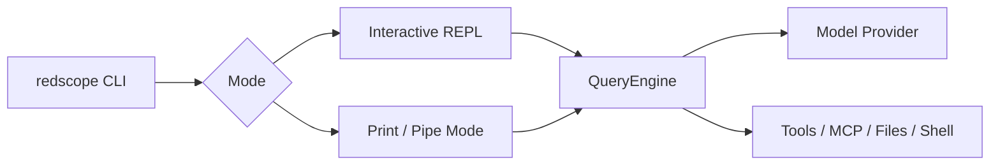
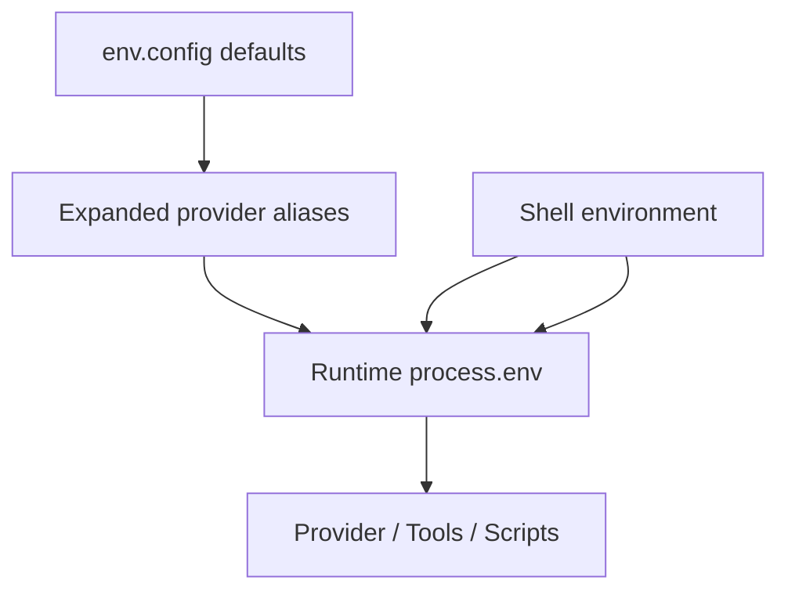
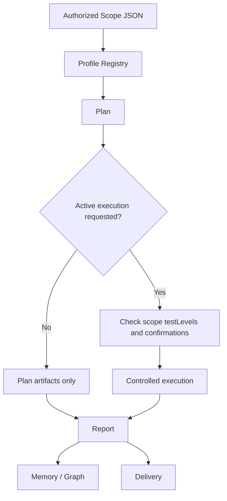

# RedScope AI 使用文档

[返回中文 README](../README.md) | [English README](../README.en.md)

本文档面向准备把项目上传到 GitHub、交给团队使用或二次开发的维护者，覆盖命令、配置文件、环境变量、安装流程、安全工作流和常见示例。

## 目录

- [安装](#安装)
- [CLI 总览](#cli-总览)
- [主命令与全局选项](#主命令与全局选项)
- [子命令参考](#子命令参考)
- [Bun 脚本命令](#bun-脚本命令)
- [配置文件](#配置文件)
- [env.config 配置](#envconfig-配置)
- [settings.json 配置](#settingsjson-配置)
- [MCP 配置](#mcp-配置)
- [安全套件配置](#安全套件配置)
- [使用示例](#使用示例)
- [开发流程](#开发流程)

## 安装

普通用户一键安装：

```bash
npm i -g @redscope-ai/redscope
redscope --version
```

升级到最新发布版：

```bash
npm i -g @redscope-ai/redscope@latest
```

卸载：

```bash
npm uninstall -g @redscope-ai/redscope
```

### 源码开发

```bash
bun install
bun run build
```

开发运行：

```bash
bun run dev
BUN_INSPECT=9229 bun run dev:inspect
```

质量检查：

```bash
bun run typecheck
bun test
bun run lint
bun run test:all
```

## CLI 总览

```text
redscope [prompt] [options]
redscope <subcommand> [options]
```

默认执行交互式终端会话。传入 `-p` 或 `--print` 时进入非交互式模式，适合脚本、CI 和管道。



## 主命令与全局选项

| 命令或选项 | 用法 | 说明 |
| --- | --- | --- |
| `redscope` | `redscope` | 启动交互式 REPL |
| Prompt | `redscope "分析这个项目"` | 直接带入初始提示词 |
| `--version`, `-v`, `-V` | `redscope --version` | 输出版本并退出 |
| `--debug [filter]` | `redscope --debug api,hooks` | 开启调试日志，可按分类过滤 |
| `--debug-file <path>` | `redscope --debug-file logs/debug.log` | 写入调试日志文件 |
| `--verbose` | `redscope --verbose` | 覆盖配置中的 verbose 设置 |
| `-p`, `--print` | `redscope -p "总结"` | 非交互式输出并退出 |
| `--output-format <format>` | `--output-format text\|json\|stream-json` | 仅 print 模式有效 |
| `--input-format <format>` | `--input-format text\|stream-json` | 控制 print 模式输入 |
| `--json-schema <schema>` | `redscope -p "..." --json-schema '{"type":"object"}'` | 结构化输出校验 |
| `--include-partial-messages` | `redscope -p --output-format stream-json --include-partial-messages` | 输出流式片段 |
| `--include-hook-events` | `--include-hook-events` | stream-json 中输出 hook 生命周期事件 |
| `--bare` | `redscope --bare -p "..."` | 最小模式，跳过 hooks、LSP、插件同步、自动记忆等 |
| `--dangerously-skip-permissions` | `redscope --dangerously-skip-permissions` | 跳过权限检查，仅限隔离沙箱 |
| `--allow-dangerously-skip-permissions` | `redscope --allow-dangerously-skip-permissions` | 允许会话内选择跳过权限 |
| `--allowedTools` / `--allowed-tools` | `--allowedTools "Read,Grep,Glob"` | 允许工具列表 |
| `--disallowedTools` / `--disallowed-tools` | `--disallowedTools "Bash(git:*)"` | 禁止工具列表 |
| `--tools <tools...>` | `--tools "Read,Edit"` | 指定可用内置工具，空字符串禁用全部 |
| `--mcp-config <configs...>` | `--mcp-config .mcp.json` | 从 JSON 文件或 JSON 字符串加载 MCP |
| `--system-prompt <prompt>` | `--system-prompt "You are..."` | 替换系统提示词 |
| `--append-system-prompt <prompt>` | `--append-system-prompt "额外规则"` | 追加系统提示词 |
| `--permission-mode <mode>` | `--permission-mode acceptEdits` | 设置权限模式 |
| `-c`, `--continue` | `redscope --continue` | 继续当前目录最近会话 |
| `-r`, `--resume [value]` | `redscope --resume` | 按会话 ID 或搜索词恢复会话 |
| `--fork-session` | `redscope --resume <id> --fork-session` | 恢复时创建新会话 ID |
| `--from-pr [value]` | `redscope --from-pr 123` | 恢复关联 PR 的会话 |
| `--no-session-persistence` | `redscope -p --no-session-persistence` | print 模式不保存会话 |
| `--model <model>` | `redscope --model sonnet` | 指定模型别名或完整模型 ID |
| `--effort <level>` | `--effort low\|medium\|high\|max` | 指定推理努力等级 |
| `--agent <agent>` | `redscope --agent reviewer` | 指定当前会话 agent |
| `--fallback-model <model>` | `redscope -p --fallback-model haiku` | 默认模型过载时回退 |
| `--settings <file-or-json>` | `redscope --settings .redscope/settings.json` | 加载额外 settings |
| `--add-dir <directories...>` | `redscope --add-dir ../docs` | 增加工具可访问目录 |
| `--ide` | `redscope --ide` | 启动时自动连接可用 IDE |
| `--strict-mcp-config` | `redscope --mcp-config mcp.json --strict-mcp-config` | 只使用命令行指定的 MCP |
| `--session-id <uuid>` | `redscope --session-id <uuid>` | 使用指定会话 ID |
| `-n`, `--name <name>` | `redscope -n "审计会话"` | 设置会话显示名 |
| `--agents <json>` | `redscope --agents '{"reviewer":{...}}'` | 临时定义自定义 agents |
| `--setting-sources <sources>` | `--setting-sources user,project,local` | 限定加载的配置来源 |
| `--plugin-dir <path>` | `--plugin-dir ./plugins` | 本会话加载额外插件目录，可重复 |
| `--disable-slash-commands` | `redscope --disable-slash-commands` | 禁用 slash commands/skills |
| `--chrome` / `--no-chrome` | `redscope --chrome` | 启用或禁用 Chrome 集成 |
| `--file <specs...>` | `--file file_abc:doc.txt` | 启动时下载文件资源 |
| `-w`, `--worktree [name]` | `redscope --worktree audit-branch` | 为会话创建 git worktree |
| `--tmux` | `redscope --worktree audit --tmux` | 为 worktree 会话创建 tmux/iTerm pane |

## 子命令参考

### MCP

| 命令 | 用法 | 说明 |
| --- | --- | --- |
| `mcp serve` | `redscope mcp serve` | 启动 RedScope AI MCP server |
| `mcp add` | `redscope mcp add my-server npx -- -y @my-org/mcp-server` | 添加 stdio/SSE/HTTP MCP server |
| `mcp add-json` | `redscope mcp add-json my-server '{"type":"stdio","command":"npx","args":["-y","pkg"]}'` | 用 JSON 字符串添加 MCP |
| `mcp list` | `redscope mcp list` | 列出已配置 MCP，并做健康检查 |
| `mcp get <name>` | `redscope mcp get my-server` | 查看单个 MCP 配置详情 |
| `mcp remove <name>` | `redscope mcp remove my-server -s user` | 删除 MCP 配置 |
| `mcp add-from-claude-desktop` | `redscope mcp add-from-claude-desktop -s user` | 从桌面配置导入 MCP |
| `mcp reset-project-choices` | `redscope mcp reset-project-choices` | 重置项目级 `.mcp.json` 审批选择 |

### Auth

| 命令 | 用法 | 说明 |
| --- | --- | --- |
| `auth login` | `redscope auth login` | 登录 Anthropic/RedScope 账户 |
| `auth login --console` | `redscope auth login --console` | 使用 Console API 计费登录 |
| `auth status` | `redscope auth status --text` | 查看认证状态 |
| `auth logout` | `redscope auth logout` | 退出登录 |
| `setup-token` | `redscope setup-token` | 配置长期 token |

### Config

| 命令 | 用法 | 说明 |
| --- | --- | --- |
| `config legacy-claude status` | `redscope config legacy-claude status --json` | 查看是否读取 legacy Claude 配置 |
| `config legacy-claude enable` | `redscope config legacy-claude enable --scope user` | 开启 legacy Claude 配置兼容 |
| `config legacy-claude disable` | `redscope config legacy-claude disable --scope user` | 关闭 legacy Claude 配置兼容 |

### Plugin

| 命令 | 用法 | 说明 |
| --- | --- | --- |
| `plugin validate` | `redscope plugin validate ./my-plugin` | 校验插件或 marketplace manifest |
| `plugin list` | `redscope plugin list --json --available` | 列出已安装或可用插件 |
| `plugin marketplace add` | `redscope plugin marketplace add https://github.com/org/plugins --scope user` | 添加 marketplace |
| `plugin marketplace list` | `redscope plugin marketplace list --json` | 列出 marketplaces |
| `plugin marketplace remove` | `redscope plugin marketplace remove my-market` | 删除 marketplace |
| `plugin marketplace update` | `redscope plugin marketplace update` | 更新 marketplace |
| `plugin install` | `redscope plugin install my-plugin -s user` | 安装插件 |
| `plugin uninstall` | `redscope plugin uninstall my-plugin --keep-data` | 卸载插件 |
| `plugin enable` | `redscope plugin enable my-plugin` | 启用插件 |
| `plugin disable` | `redscope plugin disable my-plugin` | 禁用插件 |
| `plugin disable --all` | `redscope plugin disable --all` | 禁用全部插件 |
| `plugin update` | `redscope plugin update my-plugin` | 更新插件 |

### Agents 与自动化状态

| 命令 | 用法 | 说明 |
| --- | --- | --- |
| `agents` | `redscope agents` | 列出已配置 agents |
| `autonomy status` | `redscope autonomy status --deep` | 查看自动化运行、flow、team、pipe、remote-control 状态 |
| `autonomy runs` | `redscope autonomy runs 20` | 列出最近 autonomy runs |
| `autonomy flows` | `redscope autonomy flows 20` | 列出最近 autonomy flows |
| `autonomy flow` | `redscope autonomy flow <flowId>` | 查看单个 flow |
| `autonomy flow cancel` | `redscope autonomy flow cancel <flowId>` | 取消 flow |
| `autonomy flow resume` | `redscope autonomy flow resume <flowId>` | 恢复 flow |

### 维护与服务命令

| 命令 | 用法 | 说明 |
| --- | --- | --- |
| `doctor` | `redscope doctor` | 检查安装和 updater 健康状态 |
| `install` | `redscope install stable --force` | 安装 native build |
| `update` | `redscope update` | 更新 CLI |
| `server` | `redscope server --port 3000 --host 127.0.0.1` | 启动本地 session server，需 DIRECT_CONNECT feature |
| `open` / `connect` | `redscope open cc://... -p "hello"` | 连接 RedScope server，需 DIRECT_CONNECT feature |
| `ssh` | `redscope ssh user@host /repo --permission-mode acceptEdits` | SSH 远程运行，需 SSH_REMOTE feature |
| `remote-control` / `rc` | `redscope rc` | 连接远程控制环境，需 BRIDGE_MODE feature |
| `daemon` | `redscope daemon status` | daemon/后台会话入口，需 DAEMON 或 BG_SESSIONS feature |
| `job` | `redscope job list` | 模板任务入口，需 TEMPLATES feature |
| `weixin` | `redscope weixin login` | 微信 channel 集成 |

### 快速路径与兼容命令

这些入口通常由插件、远程控制、daemon 或兼容层调用；普通用户不一定会直接使用。

| 命令或选项 | 用法 | 说明 |
| --- | --- | --- |
| `--claude-in-chrome-mcp` | `redscope --claude-in-chrome-mcp` | 启动 Chrome MCP server |
| `--chrome-native-host` | `redscope --chrome-native-host` | 启动 Chrome native host |
| `--computer-use-mcp` | `redscope --computer-use-mcp` | 启动 Computer Use MCP server，需 CHICAGO_MCP feature |
| `--acp` | `redscope --acp` | 以 ACP agent stdio 模式运行，需 ACP feature |
| `--daemon-worker=<kind>` | `redscope --daemon-worker=assistant` | daemon supervisor 内部 worker 入口 |
| `--bg` / `--background` | `redscope --bg "long task"` | 后台会话快捷入口，需 BG_SESSIONS feature |
| `ps` | `redscope ps` | 兼容旧命令，映射到 `redscope daemon status` |
| `logs` | `redscope logs <id>` | 兼容旧命令，映射到 `redscope daemon logs` |
| `attach` | `redscope attach <id>` | 兼容旧命令，映射到 `redscope daemon attach` |
| `kill` | `redscope kill <id>` | 兼容旧命令，映射到 `redscope daemon kill` |
| `new` / `list` / `reply` | `redscope new ...` | 兼容旧模板任务命令，映射到 `redscope job ...` |
| `environment-runner` | `redscope environment-runner ...` | BYOC runner，需 BYOC_ENVIRONMENT_RUNNER feature |
| `self-hosted-runner` | `redscope self-hosted-runner ...` | self-hosted runner，需 SELF_HOSTED_RUNNER feature |

### 内部/ANT-only 命令

源码中保留了一些内部或 feature-gated 命令，外部构建通常不可用，文档列出它们是为了让维护者读源码时不迷路。

| 命令或选项 | 用法 | 说明 |
| --- | --- | --- |
| `up` | `redscope up` | 按最近 `CLAUDE.md` 的 `# claude up` 初始化或升级环境 |
| `rollback` | `redscope rollback 3` | 回滚到旧版本或指定版本 |
| `log` | `redscope log 0` | 查看 conversation log |
| `error` | `redscope error -1` | 查看错误日志 |
| `export` | `redscope export <sessionId> conversation.txt` | 导出会话文本 |
| `task create` | `redscope task create "Fix bug" -d "details"` | 创建任务 |
| `task list` | `redscope task list --pending --json` | 列出任务 |
| `task get` | `redscope task get <id>` | 查看任务 |
| `task update` | `redscope task update <id> -s done` | 更新任务 |
| `task dir` | `redscope task dir` | 输出任务目录 |
| `completion <shell>` | `redscope completion zsh --output redscope.zsh` | 生成 shell completion |
| `--agent-teams` | `redscope --agent-teams` | 强制多 agent 模式 |
| `--delegate-permissions` | `redscope --delegate-permissions` | 内部权限别名，等价于自动权限模式 |

## Bun 脚本命令

### 开发脚本

| 脚本 | 用法 | 说明 |
| --- | --- | --- |
| `build` | `bun run build` | 用 `build.ts` 生成 `dist/` |
| `build:bun` | `bun run build:bun` | `build.ts` 的别名 |
| `build:vite` | `bun run build:vite` | Vite 构建 + post build |
| `build:vite:only` | `bun run build:vite:only` | 只运行 Vite 构建 |
| `dev` | `bun run dev` | Dev mode 运行入口 |
| `dev:inspect` | `BUN_INSPECT=9229 bun run dev:inspect` | Dev mode + debugger |
| `prepublishOnly` | `bun run prepublishOnly` | 发布前构建并运行 publish guard |
| `lint` | `bun run lint` | Biome lint 检查 |
| `lint:fix` | `bun run lint:fix` | Biome 自动修复 |
| `format` | `bun run format` | 格式化 `src/` |
| `test` | `bun test` | 运行所有测试 |
| `test:production` | `bun run test:production` | 生产构建测试 |
| `test:production:offline` | `bun run test:production:offline` | 离线生产构建测试 |
| `test:production:verbose` | `bun run test:production:verbose` | 详细输出生产构建测试 |
| `test:production:bun` | `bun run test:production:bun` | 使用 Bun 路径测试生产构建 |
| `typecheck` | `bun run typecheck` | TypeScript 零错误检查 |
| `test:all` | `bun run test:all` | typecheck + test |
| `check:bundle` | `bun run check:bundle` | 检查 bundle 完整性 |
| `health` | `bun run health` | 健康检查脚本 |
| `check:unused` | `bun run check:unused` | 检查未使用导出 |
| `rcs` | `bun run rcs` | 启动 Remote Control Server |
| `postinstall` | `bun run postinstall` | 安装后并行执行 postinstall、Chrome MCP setup 等脚本 |

### 安全套件脚本

| 脚本 | 用法 | 说明 |
| --- | --- | --- |
| `redscope:tool` | `bun run redscope:tool -- --list` | 列出或安装受控安全工具 |
| `redscope:sources` | `bun run redscope:sources -- --check` | 检查/更新 PoC 和模板参考源 |
| `redscope:egress` | `bun run redscope:egress -- --check --config tools/authorized-egress.example.json` | 校验授权 egress |
| `redscope:profile` | `bun run redscope:profile -- --profile baseline-url-review --scope tools/authorized-scope.example.json --target https://www.example.com/` | 计划或执行 profile |
| `redscope:workflow` | `bun run redscope:workflow -- --profile baseline-url-review --scope tools/authorized-scope.example.json --target https://www.example.com/` | profile + report + observe 一体流程 |
| `redscope:batch` | `bun run redscope:batch -- --profile authorized-http-probe --scope tools/authorized-scope.example.json --targets tools/targets.txt` | 批量目标流程 |
| `redscope:command` | `bun run redscope:command -- https://www.example.com/ --scope tools/authorized-scope.example.json --json` | 根据输入自动推断 profile |
| `redscope:report` | `bun run redscope:report -- --latest --profile baseline-url-review` | 归一化报告 |
| `redscope:observe` | `bun run redscope:observe -- --all` | 写入本地 memory |
| `redscope:graph` | `bun run redscope:graph -- --memory-root tools/memory --json` | 导出 memory graph |
| `redscope:graph-import` | `bun run redscope:graph-import -- --graph tools/memory/redscope-memory-graph.json --retention-days 30 --access-label redscope_internal --owner "Security Team" --purpose "authorized review" --json` | 准备 Neo4j/Cypher 导入包 |
| `redscope:evtx` | `bun run redscope:evtx -- --artifact tools/artifacts/security.evtx --json` | 本地 EVTX 元数据解析 |
| `redscope:drafts` | `bun run redscope:drafts -- --latest --profile authorized-poc-candidate-validation --json` | 生成 scope 草稿 |
| `redscope:deliver` | `bun run redscope:deliver -- --latest --profile baseline-url-review --status ready-for-review --reviewer "Analyst"` | 生成交付包 |
| `redscope:publish-guard` | `bun run redscope:publish-guard` | 发布前检查 secrets 与 package 内容 |

安全套件的完整策略和高级示例见 [tools/README.md](../tools/README.md)。

## 配置文件

| 文件 | 位置 | 用途 |
| --- | --- | --- |
| `env.config` | 用户配置目录，默认 `~/.redscope/env.config` | 模型 provider、API Key、默认模型、安全套件默认路径 |
| `env.config.example` | 仓库根目录 | 可复制的安全示例模板 |
| `settings.json` | `~/.redscope/settings.json` | 用户级设置：权限、hooks、agents、插件、UI 等 |
| `settings.json` | `.redscope/settings.json` | 项目共享设置 |
| `settings.local.json` | `.redscope/settings.local.json` | 项目本地私有设置，不建议提交 |
| `.mcp.json` | 项目根目录 | 项目级 MCP server 配置，首次使用需审批 |
| `REDSCOPE.md` | 项目根目录或 `.redscope/REDSCOPE.md` | 项目记忆和 AI 工作说明 |
| `REDSCOPE.local.md` | 项目根目录 | 本地私有记忆 |
| `.redscope/rules/*.md` | 项目根目录 | 项目规则文件 |
| `tools/authorized-scope.example.json` | `tools/` | 被动/基线授权 scope 示例 |
| `tools/authorized-active-scope.example.json` | `tools/` | 主动测试 scope 示例 |
| `tools/authorized-egress.example.json` | `tools/` | 授权 egress 示例 |
| `tools/redscope-run-profiles.json` | `tools/` | profile 注册表 |
| `tools/redscope-tool-registry.json` | `tools/` | 外部工具注册表 |
| `tools/redscope-source-registry.json` | `tools/` | PoC/模板源注册表 |
| `package.json` | 根目录 | Bun/npm 脚本、workspace、依赖、bin |
| `biome.json` | 根目录 | lint/format 配置 |
| `tsconfig.json` | 根目录 | TypeScript strict 配置 |
| `vite.config.ts` | 根目录 | Vite 构建配置 |

## env.config 配置

`env.config` 支持 `KEY=value`、`export KEY=value`、单引号、双引号和 `#` 注释。首次启动时，如果没有 `env.config`，程序会在用户配置目录生成注释模板。旧配置目录里的 `.env` 只用于迁移，不推荐继续使用项目根目录 `.env`。

优先级：



常用 provider：

| Provider | 推荐配置 |
| --- | --- |
| Anthropic | `REDSCOPE_MODEL_PROVIDER=anthropic` + `ANTHROPIC_API_KEY` 或 `ANTHROPIC_AUTH_TOKEN` |
| OpenAI 兼容 | `REDSCOPE_MODEL_PROVIDER=openai` + `REDSCOPE_BASE_URL` + `REDSCOPE_API_KEY` + `REDSCOPE_MODEL` |
| DeepSeek | `REDSCOPE_MODEL_PROVIDER=deepseek` + `DEEPSEEK_API_KEY` + `DEEPSEEK_MODEL` |
| DeepSeek Anthropic 协议 | `REDSCOPE_MODEL_PROVIDER=deepseek-anthropic` + `DEEPSEEK_API_KEY` |
| GLM/Zhipu/Z.ai | `REDSCOPE_MODEL_PROVIDER=glm` + `GLM_API_KEY` |
| Kimi/Moonshot | `REDSCOPE_MODEL_PROVIDER=kimi` + `KIMI_API_KEY` |
| MiniMax | `REDSCOPE_MODEL_PROVIDER=minimax` + `MINIMAX_API_KEY` |
| Qwen/DashScope | `REDSCOPE_MODEL_PROVIDER=qwen` + `DASHSCOPE_API_KEY` |
| Gemini | `REDSCOPE_MODEL_PROVIDER=gemini` + `GEMINI_API_KEY` |
| Grok/xAI | `REDSCOPE_MODEL_PROVIDER=grok` + `GROK_API_KEY` 或 `XAI_API_KEY` |

复制模板：

```bash
# macOS/Linux
mkdir -p ~/.redscope
cp env.config.example ~/.redscope/env.config

# Windows PowerShell
New-Item -ItemType Directory -Force $env:USERPROFILE\.redscope
Copy-Item env.config.example $env:USERPROFILE\.redscope\env.config
```

## settings.json 配置

`settings.json` 适合保存行为配置，不推荐继续把模型 API Key 写入 `settings.json.env`。模型端点和密钥优先使用 `env.config`。

用户级示例：

```json
{
  "permissions": {
    "defaultMode": "acceptEdits",
    "allow": ["Read", "Grep", "Glob"],
    "deny": ["Bash(rm:*)"]
  },
  "cleanupPeriodDays": 30,
  "includeGitInstructions": true,
  "defaultShell": "powershell",
  "worktree": {
    "symlinkDirectories": ["node_modules"],
    "sparsePaths": ["src", "packages", "docs"]
  }
}
```

配置来源常见层级：

```text
managed settings > command flags > local settings > project settings > user settings
```

项目共享设置放在 `.redscope/settings.json`；本机私有设置放在 `.redscope/settings.local.json`。

## MCP 配置

项目级 `.mcp.json` 示例：

```json
{
  "mcpServers": {
    "filesystem": {
      "type": "stdio",
      "command": "npx",
      "args": ["-y", "@modelcontextprotocol/server-filesystem", "."]
    },
    "remote-api": {
      "type": "http",
      "url": "https://mcp.example.com/mcp"
    }
  }
}
```

通过 CLI 添加：

```bash
redscope mcp add filesystem npx -- -y @modelcontextprotocol/server-filesystem .
redscope mcp add-json remote-api '{"type":"http","url":"https://mcp.example.com/mcp"}' -s user
redscope mcp list
```

MCP 工具权限名通常形如 `mcp__serverName__toolName`，可以在 `allowedTools` 或 `disallowedTools` 中控制。

## 安全套件配置

安全套件围绕 scope 文件运行。不要对未授权目标执行任何 active 或 restricted profile。

最小流程：

```bash
bun run redscope:profile -- --list
bun run redscope:workflow -- --profile baseline-url-review --scope tools/authorized-scope.example.json --target https://www.example.com/
bun run redscope:report -- --latest --profile baseline-url-review
bun run redscope:observe -- --latest --profile baseline-url-review
bun run redscope:deliver -- --latest --profile baseline-url-review --status ready-for-review --reviewer "Analyst"
```

主动测试需要：

```bash
bun run redscope:workflow -- --profile authorized-http-probe --scope tools/authorized-active-scope.example.json --target https://www.example.com/ --execute --confirm-active
```

流程图：



## 使用示例

### 审查当前仓库

```bash
redscope "阅读这个仓库，列出主要模块和潜在风险"
```

### 生成 JSON 输出

```bash
redscope -p "输出这个项目的三条发布说明" --output-format json
```

### 只允许只读工具

```bash
redscope -p "审查 src 目录" --allowedTools "Read,Grep,Glob" --disallowedTools "Bash,Edit,Write"
```

### 使用 OpenAI 兼容本地模型

```dotenv
REDSCOPE_MODEL_PROVIDER=openai
REDSCOPE_BASE_URL=http://localhost:11434/v1
REDSCOPE_API_KEY=ollama
REDSCOPE_MODEL=qwen2.5-coder
```

```bash
redscope -p "解释 src/query.ts 的职责"
```

### 批量目标计划

```bash
bun run redscope:batch -- --profile baseline-url-review --scope tools/authorized-scope.example.json --targets tools/targets.txt --json
```

### 生成交付包

```bash
bun run redscope:deliver -- --latest --profile baseline-url-review --status ready-for-review --reviewer "Security Team" --pdf
```

## 开发流程

推荐提交前流程：

```bash
bun run typecheck
bun run lint
bun test
bun run build
```

提交信息使用 Conventional Commits：

```text
feat: 添加新的安全 profile
fix: 修复 env.config provider 展开
docs: 更新 README 使用文档
chore: 调整发布检查
```

新增功能时注意：

- TypeScript strict 必须零错误。
- Feature flag 使用 `import { feature } from 'bun:bundle'`，并且 `feature('FLAG')` 只能直接出现在 `if` 或三元条件里。
- 生产代码不要使用 `as any`。
- 安全套件默认只计划，不执行主动扫描。
- 文档、README、配置示例不要包含真实 API Key、token、cookie 或授权凭据。
